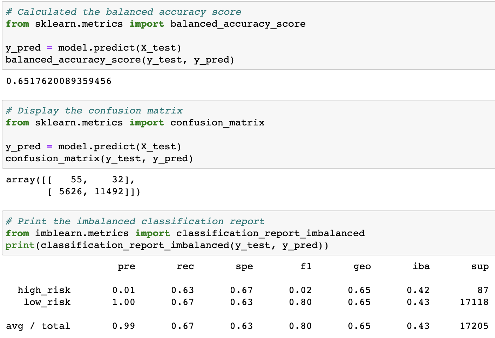

# Credit_Risk_Analysis
## Overview of the project
Credit risk is an inherently unbalanced classification problem, as good loans easily outnumber risky loans. The purpose of this project is to perform six different machine learning models to analyze credit card risk, evaluate the performance of these models, and make recommendations on whether they should be used to predict credit risk. The project consists of three tasks:
* Use resampling models to predict credit risk
    * Oversample the data: RandomOverSampler and SMOTE algorithms
    * Undersample the data: ClusterCentroids algorithm
* Use the combinatorial approach of over- and undersampling SMOTEENN algorithm to predict credit risk
* Use ensemble classifiers to predict credit risk
    * BalancedRandomForestClassifier algorithm
    * EasyEnsembleClassifier algorithm

## Results
### I. RandomOverSampler

* The balanced accuracy score is 65%.
* For high risk loans, the precision is very low with 1%, which means only 1% of the predicted high risk loans are true high risk. The recall is 63% while the F1 score is quite low (0.02). 

### II. SMOTE Oversampling

### III. ClusterCentroids Undersampling

### IV. SMOTEENN Combination Sampling

### V. Balanced Random Forest Classifier

### VI. Easy Ensemble Classifier

## Summary
There is a summary of the results (2 pt)
There is a recommendation on which model to use, or there is no recommendation with a justification

From the confusion matrix results, the precision for the bad loan applications is low, indicating a large number of false positives, which indicates an unreliable positive classification. The recall is also low for the bad loan applications, which is indicative of a large number of false negatives. The F1 score is also low (33).
In summary, this random forest model is not good at classifying fraudulent loan applications because the model's accuracy, 0.520, and F1 score are low.